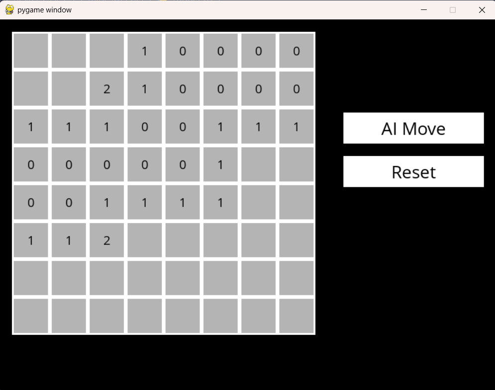

# 🧠 Minesweeper AI

This project is a Python-based implementation of the classic **Minesweeper** game, enhanced with an **AI agent** that intelligently deduces mine locations using logical inference.

## 🎮 Features

- Interactive Minesweeper gameplay using **Pygame**
- **AI assistant** that:
  - Tracks moves, known safes, and mines
  - Makes logical inferences from game knowledge
  - Chooses safe moves or makes smart guesses
- Full GUI with instructions, reset button, and AI move support
- 8x8 grid with 8 randomly placed mines by default

## 🧹 File Overview

### `minesweeper.py`

Core logic:

- `Minesweeper`: Game state and board management
- `Sentence`: Logic statements representing knowledge about cells
- `MinesweeperAI`: The intelligent agent using propositional logic

### `runner.py`

User interface:

- Initializes the game using **Pygame**
- Handles user clicks, AI actions, and game flow
- Renders the board, flags, mines, and move results

## 🛠 Requirements

- Python 3.6+
- Pygame (`pip install pygame`)

Ensure the following assets are present in the correct paths:

```
assets/
├── fonts/
│   └── OpenSans-Regular.ttf
└── images/
    ├── flag.png
    └── mine.png
```

## 🚀 Running the Game

```bash
python runner.py
```

Click **Play Game**, then:

- Left-click to reveal a cell
- Right-click to flag a suspected mine
- Click **AI Move** to let the AI make a move
- Click **Reset** to start over

## 🧠 How the AI Works

- Learns from every revealed cell and updates a **knowledge base**
- Identifies known mines/safes using logical deduction
- Infers new knowledge by comparing and subtracting sentences
- Chooses moves using `make_safe_move()` or `make_random_move()`

## 🏑 Future Improvements

- Add difficulty settings (grid size, mine count)
- Improve AI inference depth
- Display win/loss counters

## Screenshots


## 📄 License

This project is open-source and free to use for learning or extension purposes.
